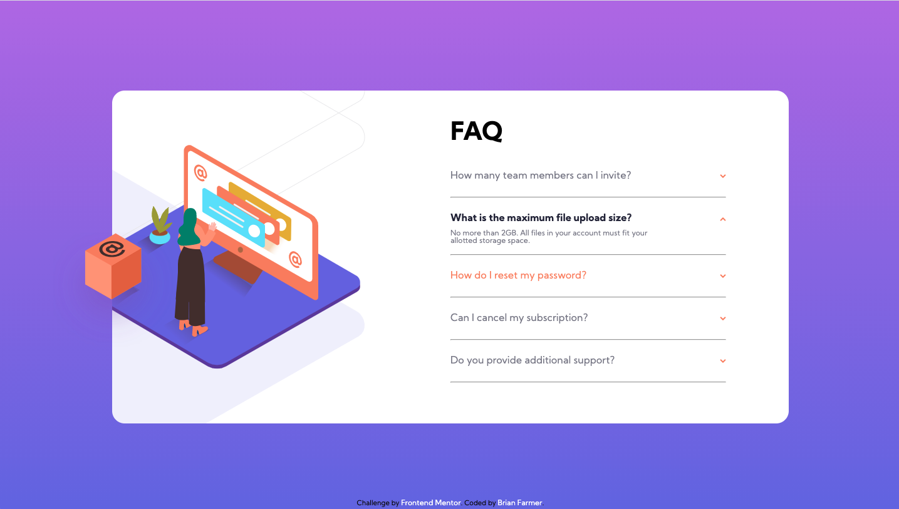

# Frontend Mentor - FAQ accordion card solution

This is a solution to the [FAQ accordion card challenge on Frontend Mentor](https://www.frontendmentor.io/challenges/faq-accordion-card-XlyjD0Oam). Frontend Mentor challenges help you improve your coding skills by building realistic projects.

## Table of contents

- [Overview](#overview)
  - [The challenge](#the-challenge)
  - [Screenshot](#screenshot)
  - [Links](#links)
- [My process](#my-process)
  - [Built with](#built-with)
  - [What I learned](#what-i-learned)
  - [Continued development](#continued-development)
  - [Useful resources](#useful-resources)
- [Author](#author)

## Overview

### The challenge

Users should be able to:

- View the optimal layout for the component depending on their device's screen size
- See hover states for all interactive elements on the page
- Hide/Show the answer to a question when the question is clicked

### Screenshot



### Links

- Solution URL: [https://www.frontendmentor.io/solutions/accordion-card-using-sass-and-javascript-\_ID2lD3oK](https://www.frontendmentor.io/solutions/accordion-card-using-sass-and-javascript-_ID2lD3oK)
- Live Site URL: [https://fem-accordioncard.netlify.app/](https://fem-accordioncard.netlify.app/)

## My process

### Built with

- Semantic HTML5 markup
- SASS Pre-Processor
- CSS custom properties
- Flexbox
- Javascript functionality

### What I learned

This was a good practice working with img layering, positioning and z index priority. Initially I struggled with having the main person image not being allowed to overflow out side its div container while allowing the box to appear like it was coming out of the container.

To solve this I placed the box img out side of the section that overflow: hidden was applied to and used absolute positioning to move the box where it needed to be and it worked nicely.

```html
<main>
  
  <section class="main-content">
    <div class="main-img">
      
      
    </div>
  </section>
</main>
```

```css
main {
  position: relative;
  .box {
    z-index: 2;
    position: absolute;
    left: 6%;
    top: 50%;
    transform: translateY(-22%);
  }
}

section {
  position: relative;
  overflow: hidden;
}

.main-img {
  .background-pattern {
    position: absolute;
    z-index: 0;
    left: -52%;
    top: -56%;
  }

  .woman {
    position: absolute;
    z-index: 1;
    left: -7%;
    top: 50%;
    transform: translateY(-50%);
  }
}
```

In my javascript I wanted to practice using the "this" keywod to trasverse the DOM instead of using the event.target

```js
function viewParagraph() {
  // Var
  const arrowImg = this.closest("div").children[1];
  const pText = this.closest(".text-container").children[1];
  const h4Text = this.closest("div").children[0];

  if (this.className != "dark") {
    arrow.forEach((el) => el.classList.remove("active"));
    paragraph.forEach((el) => el.classList.remove("view"));
    header4.forEach((el) => el.classList.remove("dark"));
    arrowImg.classList.toggle("active");
    h4Text.classList.toggle("dark");
    pText.classList.toggle("view");
  } else {
    arrow.forEach((el) => el.classList.remove("active"));
    paragraph.forEach((el) => el.classList.remove("view"));
    header4.forEach((el) => el.classList.remove("dark"));
  }
}
```

### Continued development

I thought this was a well designed component that has purpose, function, and style. I want to create more of these to create a library of components that I can add to my portfolio. Possibly even creating a carousel style display to move between them for display purposes.

## Author

- Website - [Brian Farmer](https://brianlfarmerllc-biosite.netlify.app/)
- GitHub URL: - [GitHub URL](https://github.com/brianlfarmerllc/fem_accordion_card)
- Frontend Mentor - [@brianlfarmerllc](https://www.frontendmentor.io/profile/brianlfarmerllc)
